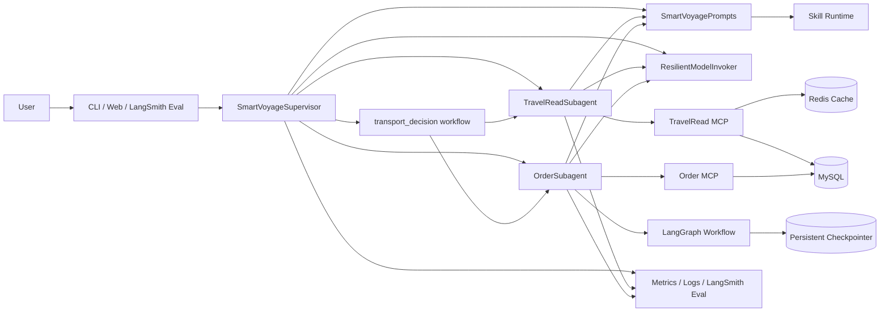
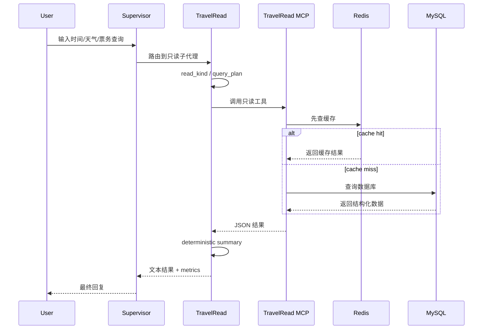
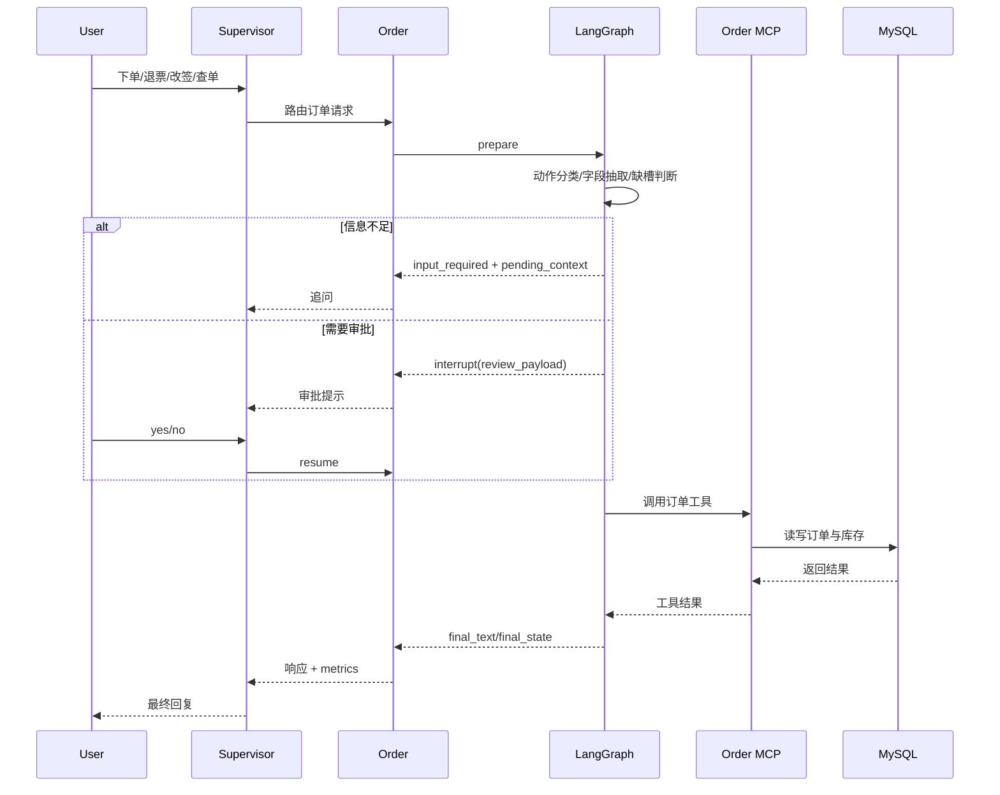
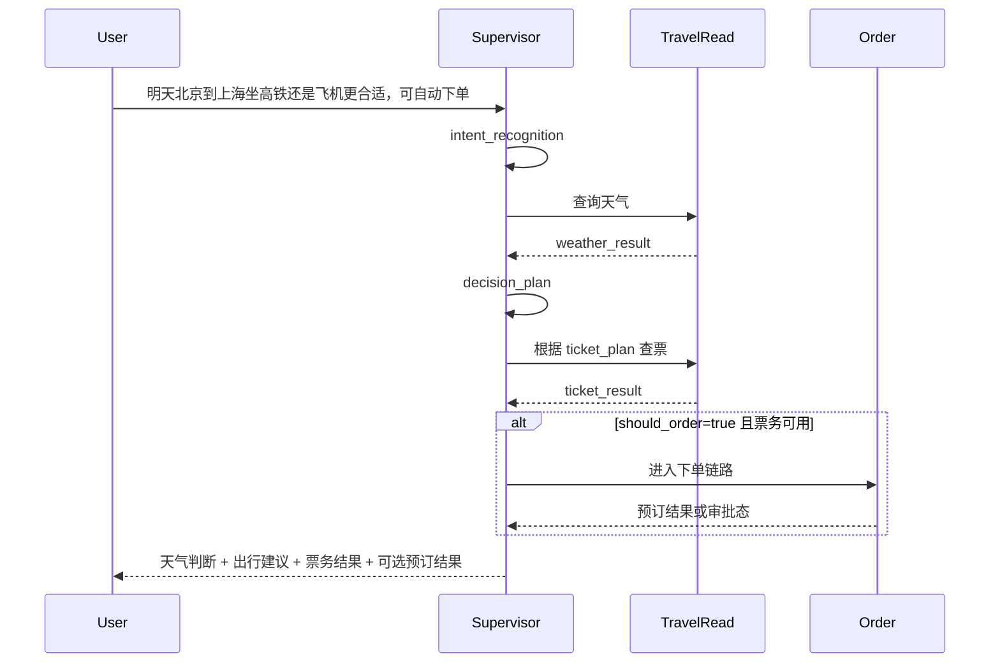

# SmartVoyage 架构说明

## 1. 项目定位

SmartVoyage 是一个聚焦交通票务场景的多代理 Agent 系统，核心目标不是做泛化聊天，而是把下面几类能力放进同一套可控工程里：

- 只读查询：时间、天气、火车票、机票
- 复合决策：`transport_decision`
- 事务执行：下单、查单、退票、改签
- 风险控制：HITL 审批、checkpoint 恢复
- 性能优化：缓存、deterministic formatting、阶段级模型路由
- 评测闭环：单测、组件测试、E2E、LangSmith 回归

一句话概括：这是一个“查询 + 决策 + 执行”闭环的窄领域事务型 Agent 系统。

## 2. 总体架构

## 3. 分层设计

### 3.1 编排层

核心入口是 `SmartVoyageSupervisor`，职责包括：

- 意图识别
- 用户偏好加载
- home city 补问判断
- 路由到本地子代理
- 编排 `transport_decision`
- 处理 HITL 恢复后的收尾逻辑
- 汇总全链路 metrics

这一层不直接访问底层工具，而是负责“该做什么”和“由谁来做”。

### 3.2 子代理层

当前系统固定为两个本地子代理。

#### TravelReadSubagent

负责：

- 当前时间查询
- 天气查询
- 火车票 / 机票只读查询
- weather / ticket query plan 生成
- deterministic summary 输出

特点：

- 无副作用
- 适合缓存
- 适合下沉轻模型
- 更强调时延和 Token 优化

#### OrderSubagent

负责：

- 查询我的订单
- 直接下单
- 退票
- 改签
- 缺槽追问
- HITL 审批与恢复

特点：

- 有副作用
- 有状态
- 依赖 LangGraph 工作流
- 需要 checkpoint 保持可恢复性

### 3.3 Prompt / Skill 层

项目没有把 Prompt 直接散落在业务代码里，而是通过本地 Skill Runtime 管理。

当前已有 4 个 skill：

- `intent-routing`
- `travel-read`
- `transport-decision`
- `order-operation`

每个 skill 由以下内容组成：

- `SKILL.md`
- `assets/`
- `references/`

运行时由 `core/prompts.py` 根据 `role + capability + flags` 选择 skill 资产。当前已经支持的典型 flags 包括：

- `has_relative_date`
- `has_query_rewrite_context`
- `has_pending_context`
- `weather_degraded`
- `weather_no_data`
- `is_change_order`

这样做的价值是：

- Prompt 资产结构化
- 规则可以按 capability 维护
- 更容易做灰度和模型路由实验
- 回归时能更快定位是 Prompt 规则还是业务代码出了问题

### 3.4 模型调用层

模型调用统一通过 `ResilientModelInvoker` 进入。

当前支持：

- 主模型调用
- 轻模型白名单阶段路由
- fallback 模型
- 结构化重试
- phase metrics 记录

当前默认更适合下沉到轻模型的阶段包括：

- `intent_recognition`
- `weather_plan`
- `ticket_plan`
- `order_date_resolution`

这层的重点不是“更智能”，而是“更稳、更可观测、更便于灰度”。

### 3.5 工具层

工具层通过两个 MCP 服务暴露边界。

#### TravelRead MCP

负责：

- `get_current_time`
- `query_weather`
- `query_tickets`
- Redis 只读缓存
- MySQL 只读查询封装

设计要点：

- 以 SQL 查询结果为中心返回结构化 JSON
- 在 MCP 层处理缓存，而不是把缓存逻辑塞进 Agent
- 对 Agent 暴露统一工具协议

#### Order MCP

负责：

- 查询用户订单
- 订单创建
- 退票
- 改签
- 库存扣减与回补

设计要点：

- 订单副作用不走缓存
- 事务执行和编排解耦
- 更容易做 side-effect 断言

### 3.6 状态管理层

Order 事务链路由 `LangGraph` 工作流承接，核心节点包括：

- `prepare`
- `review`
- `query_orders`
- `cancel_order`
- `change_order`
- `lookup_tickets`
- `create_order`

其中：

- 下单会先查票再进入审批
- 退票 / 改签会先做信息抽取和缺槽判断
- 审批节点通过 `interrupt / resume` 与前端或 CLI 交互
- checkpoint 由 `PersistentInMemorySaver` 落盘到本地文件

当前默认 checkpoint 文件为：

- `data/checkpoints/transport_order.pkl`

### 3.7 观测与评测层

当前观测分成三类：

- 运行时日志：`logs/app.log`、`logs/mcp.log`、`logs/web.log`
- 运行时 metrics：`phase_timings_ms`、`llm_call_count`、`tool_call_count`、`cache_hits`、`cache_misses`
- LangSmith 回归：意图、路由、语义、pending context、数据库副作用

所以这个项目不是“能跑就算完成”，而是有可观测和可回归的闭环。

## 4. 关键流程

### 4.1 只读查询流程

### 4.2 订单事务流程

### 4.3 transport_decision 复合流程

## 5. 为什么当前只拆成两个子代理

当前没有继续细拆为“天气 agent / 票务 agent / 订单查询 agent / 票务操作 agent”，原因是当前复杂度核心不在业务名词，而在执行语义：

- 只读链路强调缓存、低时延和稳定格式化
- 事务链路强调状态机、审批、恢复和副作用正确性

所以当前按“查 / 办”拆分更稳妥：

- 查：`TravelReadSubagent`
- 办：`OrderSubagent`

如果后续扩展到酒店、路线规划、景点、攻略等新域，再进一步拆 agent 才更有收益。

## 6. 当前架构里的关键工程点

- `transport_decision` 已经是显式工作流，不是单个大 Prompt。
- 天气和票务结果已经使用 deterministic formatting，而不是额外 summary LLM 调用。
- TravelRead 链路在 MCP 层做 Redis 缓存。
- Supervisor 会读取用户偏好，并支持基于 `home_city` 的补问。
- 订单链路支持 `pending_order_context`、HITL 审批和 checkpoint 恢复。
- 轻模型路由是按 phase 白名单做的，而不是全链路替换。
- LangSmith 回归不仅看文本，还会校验路由、pending context 和数据库副作用。

## 7. 架构优点与边界

优点：

- 编排、工具、Prompt、状态机边界清晰
- 事务链路风险控制明确
- 只读链路便于做缓存和时延优化
- 模型策略、缓存策略、评测策略都能独立演进
- 面试时可以从真实代码出发讲“为什么这样拆”

边界：

- 当前业务域仍然聚焦交通票务，不是完整旅行平台
- Web 会话状态当前保存在内存，未做跨实例共享
- 订单链路的 checkpoint 是本地文件级持久化，适合单机场景
- 当前工具接的是本地 MySQL / Redis，不是生产级分布式基础设施

## 8. 一句话总结

SmartVoyage 的核心不是“做了一个能聊天的票务助手”，而是把交通票务场景下的多代理编排、Prompt 资产管理、事务状态机、HITL、缓存优化和评测闭环组合成了一套可讲清、可验证、可继续演进的 Agent 工程。
