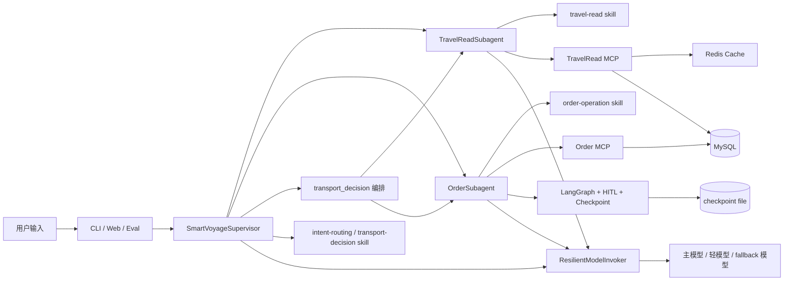
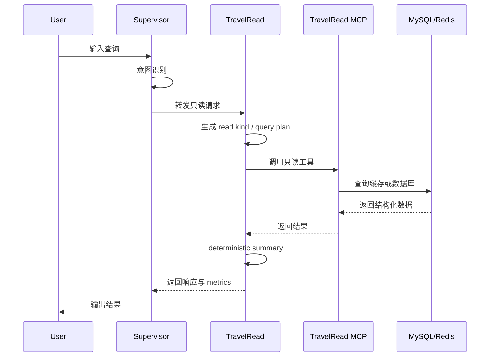
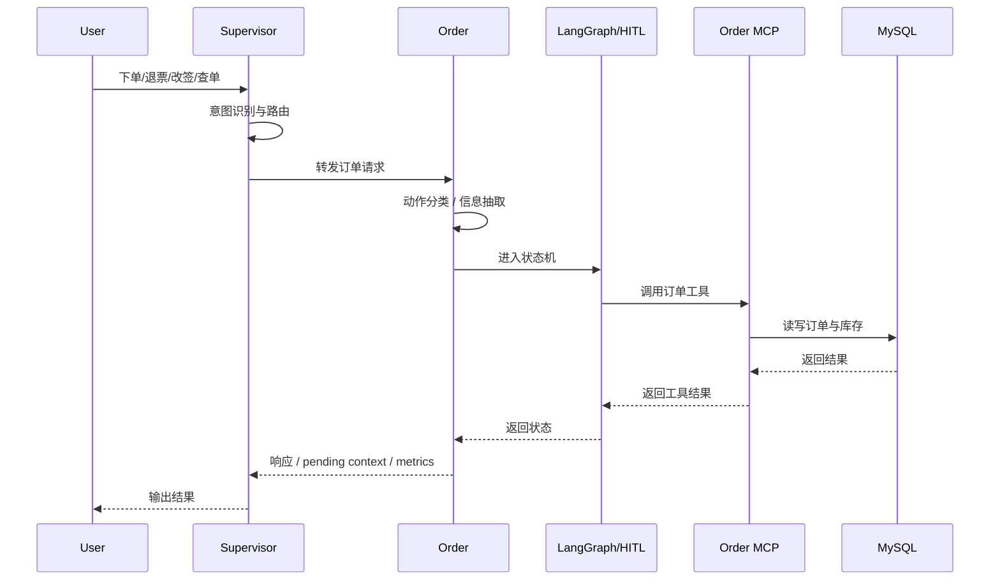
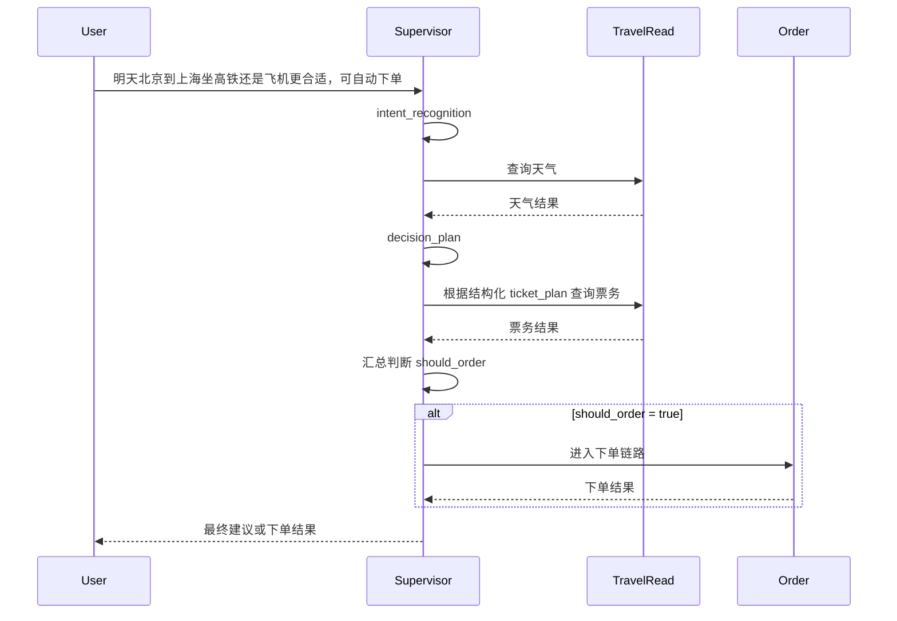

# SmartVoyage 架构说明

## 1. 项目定位

SmartVoyage 是一个面向交通出行购票场景的多代理 Agent 系统。项目目标不是做一个泛化聊天机器人，而是在相对收敛的业务域内，验证以下能力：

- 多代理编排是否能稳定处理“查询 + 决策 + 事务执行”混合任务
- MCP 工具边界是否能把数据访问和业务编排有效解耦
- Skill Runtime 是否能把 Prompt 管理从业务代码中抽离出来
- LangGraph + HITL 是否能安全承接下单、退票、改签等有副作用流程
- 性能优化是否能在保证回归稳定的前提下降低时延和 Token 消耗

## 2. 总体架构

## 3. 分层设计

### 3.1 编排层

核心入口是 `SmartVoyageSupervisor`。

职责：

- 意图识别
- 路由到本地子代理
- 编排 `transport_decision` 这种复合任务
- 管理跨代理上下文
- 统一聚合 metrics

Supervisor 不直接承担所有业务处理，而是负责“判断该做什么”和“协调谁来做”。

### 3.2 子代理层

项目当前固定为两个本地子代理。

#### TravelReadSubagent

职责：

- 当前时间查询
- 天气查询
- 火车票 / 机票只读查询
- deterministic summary 输出

特点：

- 只读
- 可缓存
- 低风险
- 更适合做时延和 Token 优化

#### OrderSubagent

职责：

- 查询我的订单
- 下单
- 退票
- 改签
- HITL 审批与恢复

特点：

- 有副作用
- 强状态
- 需要 checkpoint
- 对准确性要求高于时延

### 3.3 工具层

工具层通过 MCP 暴露，明确边界。

#### TravelRead MCP

负责：

- 当前时间
- 天气数据查询
- 火车票 / 机票查询
- Redis 只读缓存

#### Order MCP

负责：

- 订单创建
- 订单查询
- 订单取消
- 改签
- 库存扣减与回补

这样做的核心价值是：业务编排与数据访问解耦，Agent 不直接拼接底层访问细节。

### 3.4 Prompt / Skill 层

项目采用本地 Skill Runtime，而不是把所有 Prompt 硬编码在 Python 文件中。

每个 skill 由以下内容组成：

- `SKILL.md`
- `assets/`
- `references/`

运行时通过 `role + capability + flags` 选择 Prompt 资产。这样做的好处是：

- Prompt 管理结构化
- 不同任务规则可以拆开维护
- 更适合做灰度和性能实验

### 3.5 模型调用层

模型调用由 `ResilientModelInvoker` 统一管理。

支持能力：

- 主模型调用
- 按阶段切换轻模型
- fallback 模型
- 重试
- phase metrics 记录

这层的目标不是“更智能”，而是“更可控、更可观测、更稳定”。

### 3.6 观测与评测层

项目内置两类观测：

- 运行时 metrics：phase timing、llm_call_count、tool_call_count、cache_hits、cache_misses
- LangSmith 回归评测：P50 / P95 / P99、route match、semantic match、Token 消耗

因此系统优化不是拍脑袋，而是基于指标闭环。

## 4. 为什么只拆成两个子代理

当前没有按“天气 agent / 票务 agent / 订单查询 agent / 票务操作 agent”继续细拆，而是拆成 `TravelReadSubagent` 和 `OrderSubagent`。

原因：

- 读写边界比业务名词边界更关键
- 订单链路天然需要状态机、审批和恢复
- 票务查询与订单事务高度相关，拆太细会增加 agent hop 和上下文传递成本
- 当前项目业务域相对聚焦，多拆 agent 的收益低于复杂度成本

因此当前设计是按“执行语义”拆分，而不是按“功能名词”拆分：

- 查：TravelReadSubagent
- 办：OrderSubagent

这是当前阶段复杂度与可维护性的平衡点。

## 5. 关键流程

### 5.1 只读查询流程

### 5.2 订单事务流程

### 5.3 transport_decision 复合流程

## 6. 关键优化点

本项目的优化重点不是数据库，而是 LLM 往返次数和链路冗余。

已经完成的优化包括：

- 合并 `transport_decision` 内部重复决策，去掉独立 `auto_order` 判定
- 把天气和票务 summary 改成 deterministic formatting
- Redis 只读缓存覆盖时间 / 天气 / 票务查询
- 增加 phase-level metrics
- 引入按阶段轻重模型切换
- 保留 fallback 模型和重试机制

优化目标是：

- 降低 `transport_decision` 平均时延
- 降低总体 P50 / P95 / P99
- 降低 Token 消耗
- 保持回归稳定

## 7. 当前架构的优点与边界

优点：

- 职责分层清晰
- 工具边界明确
- 有状态事务链路可控
- 性能优化和评测闭环完整
- 容易继续扩展模型策略和工具能力

边界：

- 当前业务域仍然聚焦在交通票务，不是大而全的旅行平台
- 两子代理设计适合当前 scope，若后续加入酒店、景点、攻略、路线规划等新域，再细拆更多 agent 会更合理
- 当前系统偏向“窄领域深打”，不是“宽领域铺开”

## 8. 一句话总结

SmartVoyage 不是一个简单聊天机器人，而是一个在交通票务场景中验证多代理编排、事务工作流、性能优化与评测闭环的 Agent 系统。
